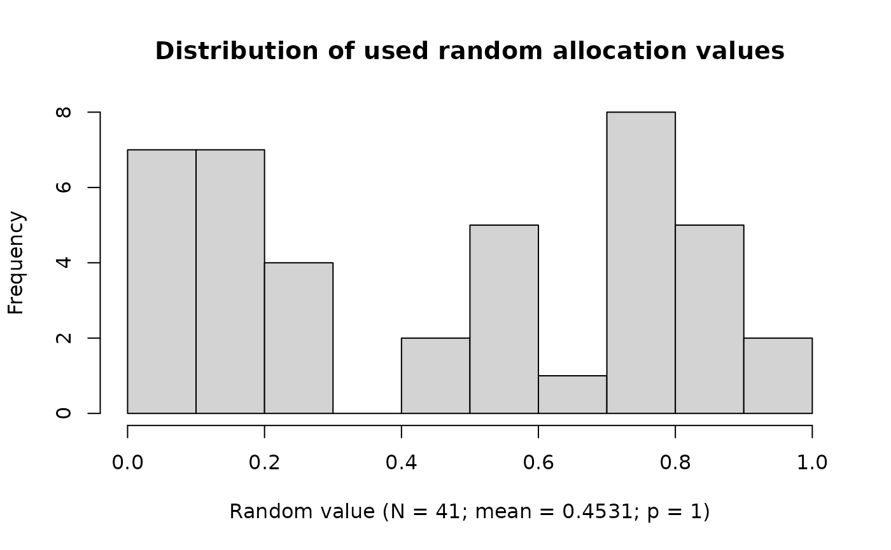
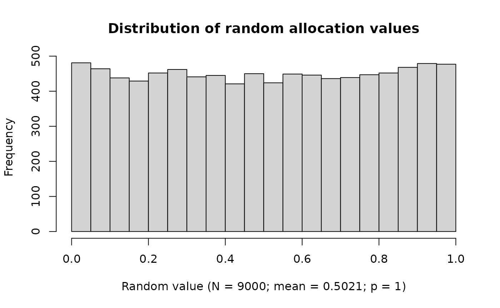

# Randomization with Flexible Block Sizes with randomforge

## Introduction

This vignette provides a practical example for **randomforge**. It
demonstrates:

- How to define treatment arms  
- How to configure project-level randomization  
- How do you implement permuted block randomization (PBR) with a fixed
  starting block size and continuation with variable block sizes
- How to perform quality control of random values  
- How to extract and inspect the generated randomization list

## Loading the randomforge Package

``` r
library(randomforge)
#> randomforge developer version 0.1.0.9046 loaded
```

## Trial Setup

### Treatment Arms

``` r
treatmentArmIds = c("Treatment", "Control")
```

### Maximum Number of Subjects per Center

``` r
maxNumberOfSubjects <- 40
```

### Seed

The seeds in this example will be generated via  
[random.org](https://www.random.org/)

``` r
seed <- createSeed()
seed
```

    #> [1] 1379678

## Creating Project and Configuration

``` r
randomDataBase <- getRandomDataBase()

randomProject <- getRandomProject(name = "Flexible PBR Example Trial")
randomDataBase$persist(randomProject)

randomConfiguration <- getRandomConfiguration(
    randomProject = randomProject, 
    treatmentArmIds = treatmentArmIds, 
    seed = seed
)
randomDataBase$persist(randomConfiguration)

ravService <- getRandomAllocationValueService()
```

## Initial Randomization Using Fixed Block Size

### Define Initial Block Length

``` r
initialBlockLength <- 8
randomMethod <- getRandomMethodPBR(
    blockSizes = getBlockSizes(treatmentArmIds, initialBlockLength)
)
for (i in 1:initialBlockLength) {
    suppressMessages(getNextRandomResult(
        randomDataBase, randomProject, randomMethod, ravService
    ))
}
```

## Variable Block Sizes for Remaining Subjects

### Define Candidate Block Sizes

``` r
blockSizes <- getBlockSizes(treatmentArmIds, c(4, 6))
blockSizeRandomizer <- getRandomBlockSizeRandomizer(
    blockSizes = blockSizes,
    seed = 2758500)
blockSizeRandomizer$initRandomValues(numberOfBlockSizes = length(blockSizes))
```

### Randomize Remaining Subjects

``` r
randomMethod <- getRandomMethodPBR(
    blockSizes = blockSizes, 
    fixedBlockDesignEnabled = FALSE, 
    blockSizeRandomizer = blockSizeRandomizer
)

for (i in 1:(maxNumberOfSubjects - initialBlockLength)) {
    suppressMessages(getNextRandomResult(
        randomDataBase, randomProject, randomMethod, ravService
    ))
}
```

## Quality Control

### Distribution of Used Random Values

``` r
plot(ravService)
```



No significant deviation from a uniform distribution is detected (p \>
0.05).

### Distribution of All Generated Random Values

``` r
plot(ravService, usedValuesOnly = FALSE)
```



## Output: Randomization List

``` r
randomList <- as.data.frame(randomDataBase)
knitr::kable(randomList)
```

| project                    | random-number | treatment-arm | status     | overall-levels-Treatment | overall-levels-Control | block-wise-levels-Treatment | block-wise-levels-Control | randomization-decision                                                        | unique-subject-id                    |
|:---------------------------|--------------:|:--------------|:-----------|-------------------------:|-----------------------:|:----------------------------|:--------------------------|:------------------------------------------------------------------------------|:-------------------------------------|
| Flexible PBR Example Trial |             1 | Treatment     | RANDOMIZED |                        1 |                      0 | Treatment:1/4               | Control:0/4               | range-set\[Treatment=\[0,0.5\], Control=\[0.5,1\]; rav=0.0212203289847821\]   | d8c8ac28-71fa-4057-92d5-de6367c1322d |
| Flexible PBR Example Trial |             2 | Treatment     | RANDOMIZED |                        2 |                      0 | Treatment:2/4               | Control:0/4               | range-set\[Treatment=\[0,0.5\], Control=\[0.5,1\]; rav=0.1417948291637\]      | 705e5507-18ea-473e-afba-2390c44b3f18 |
| Flexible PBR Example Trial |             3 | Control       | RANDOMIZED |                        2 |                      1 | Treatment:2/4               | Control:1/4               | range-set\[Treatment=\[0,0.5\], Control=\[0.5,1\]; rav=0.703004920156673\]    | 3710dc82-6f09-413e-b7ca-5496b16fda9f |
| Flexible PBR Example Trial |             4 | Control       | RANDOMIZED |                        2 |                      2 | Treatment:2/4               | Control:2/4               | range-set\[Treatment=\[0,0.5\], Control=\[0.5,1\]; rav=0.525561064947397\]    | 4c869b36-a77c-4323-9d39-360ddd60669c |
| Flexible PBR Example Trial |             5 | Treatment     | RANDOMIZED |                        3 |                      2 | Treatment:3/4               | Control:2/4               | range-set\[Treatment=\[0,0.5\], Control=\[0.5,1\]; rav=0.145504052750766\]    | 8667d6a0-8108-4613-8d9b-ad7b0ba28626 |
| Flexible PBR Example Trial |             6 | Treatment     | RANDOMIZED |                        4 |                      2 | Treatment:4/4               | Control:2/4               | range-set\[Treatment=\[0,0.5\], Control=\[0.5,1\]; rav=0.408401624765247\]    | 8c92c5af-91f8-4e53-9cab-538910e009b7 |
| Flexible PBR Example Trial |             7 | Control       | RANDOMIZED |                        4 |                      3 | Treatment:4/4               | Control:3/4               | range-set\[Treatment=\[0,0\], Control=\[0,1\]; rav=0.526814301963896\]        | df2e3225-2afa-4775-b579-976ce26a2e7d |
| Flexible PBR Example Trial |             8 | Control       | RANDOMIZED |                        4 |                      4 | Treatment:4/4               | Control:4/4               | range-set\[Treatment=\[0,0\], Control=\[0,1\]; rav=0.828539446461946\]        | 9713461a-aa6d-456f-9795-b15771c93969 |
| Flexible PBR Example Trial |             9 | Control       | RANDOMIZED |                        4 |                      5 | Treatment:0/2               | Control:1/2               | range-set\[Treatment=\[0,0.5\], Control=\[0.5,1\]; rav=0.615094124572352\]    | 97d824d7-a6ea-44af-8926-e16757ec9cce |
| Flexible PBR Example Trial |            10 | Treatment     | RANDOMIZED |                        5 |                      5 | Treatment:1/2               | Control:1/2               | range-set\[Treatment=\[0,0.5\], Control=\[0.5,1\]; rav=0.194894318003207\]    | dbf2d7a5-a55a-4d2a-83ea-76dc6eb4289a |
| Flexible PBR Example Trial |            11 | Treatment     | RANDOMIZED |                        6 |                      5 | Treatment:2/2               | Control:1/2               | range-set\[Treatment=\[0,0.5\], Control=\[0.5,1\]; rav=0.014120080973953\]    | b4add5e6-a2b2-458c-a2fc-aea5644f0321 |
| Flexible PBR Example Trial |            12 | Control       | RANDOMIZED |                        6 |                      6 | Treatment:2/2               | Control:2/2               | range-set\[Treatment=\[0,0\], Control=\[0,1\]; rav=0.180169035680592\]        | 2f0dccc1-be46-4cb9-b0f1-2bccb95ced45 |
| Flexible PBR Example Trial |            13 | Treatment     | RANDOMIZED |                        7 |                      6 | Treatment:1/3               | Control:0/3               | range-set\[Treatment=\[0,0.5\], Control=\[0.5,1\]; rav=0.246198229491711\]    | d65143fb-d9da-4cdb-90bf-d96eaf0741a9 |
| Flexible PBR Example Trial |            14 | Control       | RANDOMIZED |                        7 |                      7 | Treatment:1/3               | Control:1/3               | range-set\[Treatment=\[0,0.5\], Control=\[0.5,1\]; rav=0.508522406220436\]    | f09c59af-b573-4a58-b6ae-f0c37065af1b |
| Flexible PBR Example Trial |            15 | Treatment     | RANDOMIZED |                        8 |                      7 | Treatment:2/3               | Control:1/3               | range-set\[Treatment=\[0,0.5\], Control=\[0.5,1\]; rav=0.000603425083681941\] | 440feba7-f93c-4ee9-9c43-9ead56dfe41c |
| Flexible PBR Example Trial |            16 | Control       | RANDOMIZED |                        8 |                      8 | Treatment:2/3               | Control:2/3               | range-set\[Treatment=\[0,0.5\], Control=\[0.5,1\]; rav=0.867856977041811\]    | 8f5f460e-3c10-4670-9d02-a9848c5c223a |
| Flexible PBR Example Trial |            17 | Control       | RANDOMIZED |                        8 |                      9 | Treatment:2/3               | Control:3/3               | range-set\[Treatment=\[0,0.5\], Control=\[0.5,1\]; rav=0.871452651685104\]    | 8b3cc7ae-fb21-45a9-8640-0689d485fe7d |
| Flexible PBR Example Trial |            18 | Treatment     | RANDOMIZED |                        9 |                      9 | Treatment:3/3               | Control:3/3               | range-set\[Treatment=\[0,1\], Control=\[1,1\]; rav=0.758590350393206\]        | c94876be-fa26-4a84-b239-ac9d892d907c |
| Flexible PBR Example Trial |            19 | Treatment     | RANDOMIZED |                       10 |                      9 | Treatment:1/2               | Control:0/2               | range-set\[Treatment=\[0,0.5\], Control=\[0.5,1\]; rav=0.179464610526338\]    | 12d50f53-ffa8-42e6-a723-d23c7d44b0ff |
| Flexible PBR Example Trial |            20 | Control       | RANDOMIZED |                       10 |                     10 | Treatment:1/2               | Control:1/2               | range-set\[Treatment=\[0,0.5\], Control=\[0.5,1\]; rav=0.943183079361916\]    | d86c27d0-de1f-4d06-b848-1d9e5ee02cdd |
| Flexible PBR Example Trial |            21 | Control       | RANDOMIZED |                       10 |                     11 | Treatment:1/2               | Control:2/2               | range-set\[Treatment=\[0,0.5\], Control=\[0.5,1\]; rav=0.763430547900498\]    | 58fefd66-59e0-48ca-86c7-acf3d4e4fd18 |
| Flexible PBR Example Trial |            22 | Treatment     | RANDOMIZED |                       11 |                     11 | Treatment:2/2               | Control:2/2               | range-set\[Treatment=\[0,1\], Control=\[1,1\]; rav=0.773297929903492\]        | 3500d8f7-2301-4d57-854b-f9b2c67e58a1 |
| Flexible PBR Example Trial |            23 | Control       | RANDOMIZED |                       11 |                     12 | Treatment:0/2               | Control:1/2               | range-set\[Treatment=\[0,0.5\], Control=\[0.5,1\]; rav=0.591403880855069\]    | 83596c0b-c80d-4de4-939a-367d37edbe57 |
| Flexible PBR Example Trial |            24 | Control       | RANDOMIZED |                       11 |                     13 | Treatment:0/2               | Control:2/2               | range-set\[Treatment=\[0,0.5\], Control=\[0.5,1\]; rav=0.785737928934395\]    | cf554ae9-4510-4730-8920-48869788b52b |
| Flexible PBR Example Trial |            25 | Treatment     | RANDOMIZED |                       12 |                     13 | Treatment:1/2               | Control:2/2               | range-set\[Treatment=\[0,1\], Control=\[1,1\]; rav=0.296541688032448\]        | 75c79aea-bd56-4353-81f3-8c89a4203690 |
| Flexible PBR Example Trial |            26 | Treatment     | RANDOMIZED |                       13 |                     13 | Treatment:2/2               | Control:2/2               | range-set\[Treatment=\[0,1\], Control=\[1,1\]; rav=0.0567047209478915\]       | 6ee0eed0-13a8-42ba-b2d8-38b87c3135cf |
| Flexible PBR Example Trial |            27 | Control       | RANDOMIZED |                       13 |                     14 | Treatment:0/3               | Control:1/3               | range-set\[Treatment=\[0,0.5\], Control=\[0.5,1\]; rav=0.73090074188076\]     | 2754df2a-d8d4-4822-920e-c27366b99304 |
| Flexible PBR Example Trial |            28 | Treatment     | RANDOMIZED |                       14 |                     14 | Treatment:1/3               | Control:1/3               | range-set\[Treatment=\[0,0.5\], Control=\[0.5,1\]; rav=0.110916475299746\]    | b896c3d8-e082-4c0f-861d-14928a2b6ecf |
| Flexible PBR Example Trial |            29 | Control       | RANDOMIZED |                       14 |                     15 | Treatment:1/3               | Control:2/3               | range-set\[Treatment=\[0,0.5\], Control=\[0.5,1\]; rav=0.887901743175462\]    | d7b35bbc-3bbe-4e5a-882c-3105bca9710f |
| Flexible PBR Example Trial |            30 | Treatment     | RANDOMIZED |                       15 |                     15 | Treatment:2/3               | Control:2/3               | range-set\[Treatment=\[0,0.5\], Control=\[0.5,1\]; rav=0.125286859693006\]    | 2e0e625c-2b86-41ab-b46e-9cd7a2b1b24e |
| Flexible PBR Example Trial |            31 | Control       | RANDOMIZED |                       15 |                     16 | Treatment:2/3               | Control:3/3               | range-set\[Treatment=\[0,0.5\], Control=\[0.5,1\]; rav=0.727101013064384\]    | 011d192e-a8a2-4b10-8f18-ecc328e8b5ee |
| Flexible PBR Example Trial |            32 | Treatment     | RANDOMIZED |                       16 |                     16 | Treatment:3/3               | Control:3/3               | range-set\[Treatment=\[0,1\], Control=\[1,1\]; rav=0.0377451616805047\]       | c37c48a9-a9c4-4cc9-9654-1408b2f9ecd2 |
| Flexible PBR Example Trial |            33 | Control       | RANDOMIZED |                       16 |                     17 | Treatment:0/2               | Control:1/2               | range-set\[Treatment=\[0,0.5\], Control=\[0.5,1\]; rav=0.52538527501747\]     | 6f9642d7-3f76-49dd-aa51-8daa2643c2a7 |
| Flexible PBR Example Trial |            34 | Treatment     | RANDOMIZED |                       17 |                     17 | Treatment:1/2               | Control:1/2               | range-set\[Treatment=\[0,0.5\], Control=\[0.5,1\]; rav=0.0736770003568381\]   | 8a5802f7-b923-40c5-8434-4b7f8e73fe83 |
| Flexible PBR Example Trial |            35 | Treatment     | RANDOMIZED |                       18 |                     17 | Treatment:2/2               | Control:1/2               | range-set\[Treatment=\[0,0.5\], Control=\[0.5,1\]; rav=0.485733987297863\]    | 6b8d5917-ec03-4749-9b0c-c43729f8caba |
| Flexible PBR Example Trial |            36 | Control       | RANDOMIZED |                       18 |                     18 | Treatment:2/2               | Control:2/2               | range-set\[Treatment=\[0,0\], Control=\[0,1\]; rav=0.719684938434511\]        | a2ea2481-ee6e-4b6c-a8af-1703270ab886 |
| Flexible PBR Example Trial |            37 | Control       | RANDOMIZED |                       18 |                     19 | Treatment:0/2               | Control:1/2               | range-set\[Treatment=\[0,0.5\], Control=\[0.5,1\]; rav=0.965410947334021\]    | 8f79dc09-8d63-49bd-bd3d-5da611b40a1b |
| Flexible PBR Example Trial |            38 | Control       | RANDOMIZED |                       18 |                     20 | Treatment:0/2               | Control:2/2               | range-set\[Treatment=\[0,0.5\], Control=\[0.5,1\]; rav=0.812460775719956\]    | 2c8c34c8-b2d7-467c-adf8-5b9d32eaf311 |
| Flexible PBR Example Trial |            39 | Treatment     | RANDOMIZED |                       19 |                     20 | Treatment:1/2               | Control:2/2               | range-set\[Treatment=\[0,1\], Control=\[1,1\]; rav=0.205702553037554\]        | 8d116bc5-5097-485c-8da3-f7da3a2542c1 |
| Flexible PBR Example Trial |            40 | Treatment     | RANDOMIZED |                       20 |                     20 | Treatment:2/2               | Control:2/2               | range-set\[Treatment=\[0,1\], Control=\[1,1\]; rav=0.0162965569179505\]       | 5d876423-2257-4154-ac1a-ba104cf1b485 |

## System Information

- System: R version 4.5.2 (2025-10-31)  
- randomforge version: 0.1.0.9046  
- Platform: x86_64-pc-linux-gnu  
- Working directory: /home/runner/work/randomforge/randomforge/vignettes
